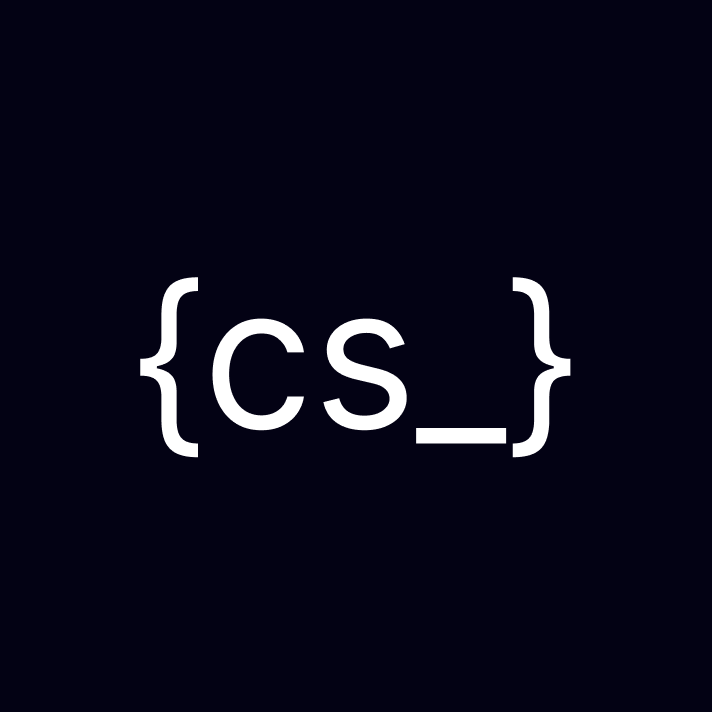

# CodeSnippets

[](https://discord.gg/tqm4eKy2)

A shared code snippets library designed to streamline the coding process by offering quick and easy access to a repository of reusable code snippets. Whether you're aiming to speed up your coding tasks or contribute to a growing collection of efficient solutions, this library is the ideal tool. It allows developers to effortlessly copy snippets for personal use and contribute their own tried-and-tested snippets to benefit the wider developer community.



## Features

- **User Authentication**: Secure sign-up and sign-in functionality powered by Clerk.
- **Snippet Management**: Full CRUD (Create, Read, Update, Delete) operations for code snippets.
- **Advanced Search**: Quickly find snippets with a powerful, real-time search implementation.
- **Language Support**: A wide range of programming languages are supported with syntax highlighting.
- **Community Contributions**: Easily contribute your own snippets and help grow the library.
- **Responsive Design**: A clean and intuitive user interface that works seamlessly across all devices.

## Tech Stack

- **Framework**: [Next.js](https://nextjs.org/)
- **Styling**: [Tailwind CSS](https://tailwindcss.com/)
- **Authentication**: [Clerk](https://clerk.com/)
- **Database**: [MongoDB](https://www.mongodb.com/) with [Mongoose](https://mongoosejs.com/)
- **State Management**: [Zustand](https://zustand-demo.pmnd.rs/)
- **UI Components**: [Shadcn UI](https://ui.shadcn.com/) & [Aceternity UI](https://ui.aceternity.com/)
- **Code Editor**: [Monaco Editor](https://microsoft.github.io/monaco-editor/)
- **Deployment**: [Vercel](https://vercel.com/)

## Getting Started

To get a local copy up and running, please follow these simple steps.

### Prerequisites

- [Node.js](https://nodejs.org/en/) (v18 or newer)
- [pnpm](https://pnpm.io/installation)

### Installation

1.  **Fork the repository**
2.  **Clone your fork**:
    ```bash
    git clone https://github.com/YOUR_USERNAME/codesnippets.git
    ```
3.  **Navigate to the project directory**:
    ```bash
    cd codesnippets
    ```
4.  **Install dependencies**:
    ```bash
    pnpm install
    ```
5.  **Set up environment variables**:
    Create a `.env.local` file at the root of your project and add the necessary environment variables. You can get the required values by joining our [Discord community](https://discord.gg/tqm4eKy2).

6.  **Run the development server**:
    ```bash
    pnpm dev
    ```

Open [http://localhost:3000](http://localhost:3000) with your browser to see the result.

## Component Architecture

This project emphasizes a clean and maintainable component structure. We use TypeScript to ensure type safety and clarity, which is particularly important when dealing with component props.

### Props and Types

All components that accept props must have a corresponding TypeScript `interface` to define the shape of those props. This practice helps prevent common errors and improves the developer experience by providing autocompletion and type checking.

For example, let's look at the `Button` component located at `components/custom/button.tsx`.

**Prop Interface Definition:**

The props for the `Button` component are defined in an `interface` named `Props`:

```typescript
interface Props {
  className?: string
  button?: {
    icon?: React.ReactElement
    label?: string
    iconClass?: string
    link?: string
    labelClass?: string
    action?: (...args: any[]) => void
  }
  children?: React.ReactElement
  isFormButton?: boolean
}
```

- **Optional Props**: Notice the use of the `?` symbol to denote optional props (e.g., `className?`).
- **Nested Objects**: The `button` prop is an object with its own set of optional properties.
- **React Types**: We use standard React types like `React.ReactElement` for props that expect JSX content.
- **Function Types**: The `action` prop is defined as a function type.

**Usage:**

When using the `Button` component, you would pass the props like this:

```jsx
import Button from '@/components/custom/button'
import { SomeIcon } from '@/lib/icons'

;<Button
  className="bg-blue-500 text-white"
  button={{
    label: 'Click Me',
    icon: <SomeIcon />,
    action: () => console.log('Button clicked!'),
  }}
/>
```

This approach ensures that our components are predictable, easy to reason about, and less prone to runtime errors.

## Contributing

Contributions are what make the open-source community such an amazing place to learn, inspire, and create. Any contributions you make are **greatly appreciated**.

Please see our [CONTRIBUTING.md](./CONTRIBUTING.MD) for details on our code of conduct, and the process for submitting pull requests to us.

## Feedback

We would love to hear your feedback! You can send us your thoughts and suggestions using the chat icon on the app or by joining our [Discord channel](https://discord.gg/tqm4eKy2) to interact with our community of developers.
